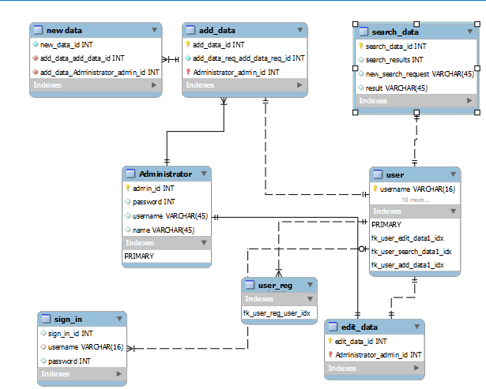

# Проєктування бази даних

## Модель бізнес-об'єктів

@startuml
skinparam monochrome true

!define DARKORANGE #FF8C00
!define FORESTGREEN #228B22
!define MEDIUMBLUE #0000CD
!define CRIMSON #DC143C

skinparam usecase {
  BackgroundColor WhiteSmoke
  BorderColor #cfd7e6
  BorderThickness 1
}

User *-- edit_data_req
edit_data_req *-- edit.file_name
edit_data_req *-- edit.creation_date

User *-- sign_in_user
sign_in_user *-- login_user
sign_in_user *-- create_new

User *-- edit_data
edit_data *-- edit_information
edit_data *-- edit_request

Administrator *-- edit_data

User *-- search_data
search_data *-- search_results
search_data *-- new_search_request

User *-- user_reg
user_reg *-- user_name
user_reg *-- email
user_reg *-- password

Administrator *-- add_data
add_data *-- new_data

User -[hidden]-> [User]
Administrator -[hidden]-> [Administrator]
edit_data_req -[hidden]-> [edit_data_req]
sign_in_user -[hidden]-> [sign_in_user]
edit_data -[hidden]-> [edit_data]
search_data -[hidden]-> [search_data]
user_reg -[hidden]-> [user_reg]
add_data -[hidden]-> [add_data]
@enduml

## ER-модель

@startuml
skinparam monochrome true

!define DARKORANGE #FF8C00
!define FORESTGREEN #228B22
!define MEDIUMBLUE #0000CD
!define CRIMSON #DC143C

skinparam usecase {
  BackgroundColor WhiteSmoke
  BorderColor #cfd7e6
  BorderThickness 1
}

entity User {
  * user_id : int
}

entity Administrator {
  * admin_id : int
}

entity edit_data_req {
  * edit_data_req_id : int
}

entity sign_in_user {
  * sign_in_user_id : int
}

entity login_user {
  * login_user_id : int
  --
  login : TEXT
  password : TEXT
}

entity create_new {
  * create_new_id : int
  --
  request : TEXT
}

entity edit_data {
  * edit_data_id : int
}

entity edit_information {
  * edit_information_id : int
  --
  request : TEXT
}

entity search_data {
  * search_data_id : int
}

entity search_results {
  * search_results_id : int
  --
  result : TEXT
}

entity new_search_request {
  * new_search_request_id : int
  --
  request : TEXT
}

entity user_reg {
  * user_reg_id : int
  --
  first_name : TEXT
  surname : TEXT
  email : TEXT
  user_name : TEXT
  password : TEXT
}

entity create_new_acc {
  * create_new_acc_id : int
}

entity new_data {
  * new_data_id : int
  --
  data : TEXT
}

User --> edit_data_req
edit_data_req --> edit_data

User --> sign_in_user
sign_in_user --> login_user
sign_in_user --> create_new

User --> edit_data
edit_data --> edit_information

Administrator --> edit_data

User --> search_data
search_data --> search_results
search_data --> new_search_request

User --> user_reg
user_reg --> create_new_acc

Administrator --> add_data
add_data --> new_data
@enduml

## Реляційна схема

